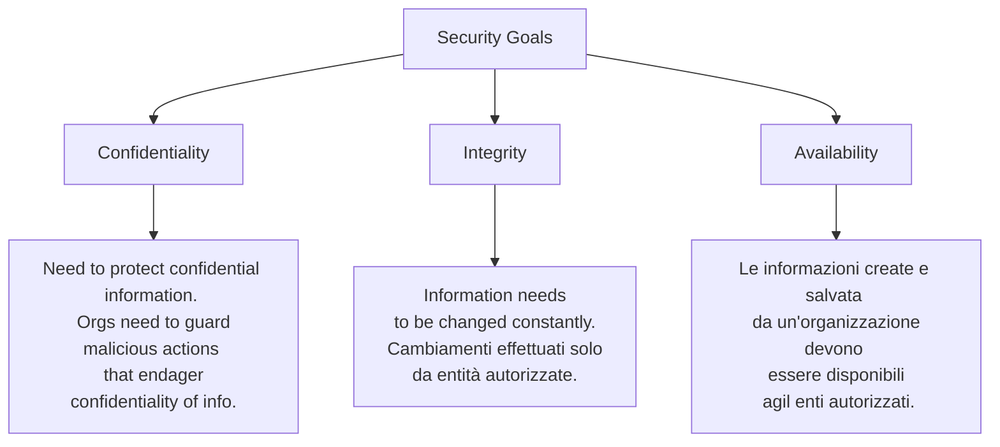
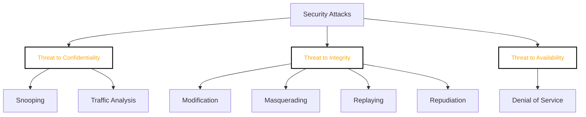

### Security....
- **Threat**: potenziale violazione della sicurezza, 
- **Attack**: assalto ai sistemi di sicurezza 
- **Service**: servizio per migliorare la sicurezza del sistema. 
- **Mechanism**: detect, prevent, recover from a security attack. 

### Confidentiality Attacks
#### Snooping
Accesso non autorizzato ai dati. 
#### Traffic analysis
Ottenere informazioni analizzando il traffico online. 

### Minacce di integrità
#### Modification
Attacker intercepts the message and changes it 
#### Masquerading / Spoofing
Attacker pretends to be the sender or receiver entity.
#### Replaying
Attacker ottiene una copia del messaggio inviato da utente autorizzato e lo spedisce in un secondo momento. 
#### Repudiation
Dopo che la comunicazione è avvenuta, uno dei due *ripudia* la conversazione, dicendo che non è mai avvenuta (o dichiara di non aver inviato il messaggio o di non averlo ricevuto.)
$\Large \longrightarrow$ PEC (posta elettronica certificata)

### Attacchi alla disponibilità 
#### DoS (Denial of Service)
Genera richieste fasulle per intasare il sistema
DoS $\Large \to$ singolo attaccante
DDoS $\Large \to$ Distributed DoS.

SYN Flooding nel TCP: si risolve bannando l'IP.

### Passive vs Active attacks
![[Pasted image 20241219102627.png#invert|center|600]]

## Placement of Security
Lower levels: 
- More info protected by the service
- More transparent for users
- Complex, expensive
- Vulnerable in bridges
Higher levels
- Less info protected, but protected better
- More intrusive for user 
- Needs more keys
### Physical layer
- Link wide
- Sensors to detect physical intrusions on the medium (cavi sottomarini hanno sensore di pressione: pressione cala$\Large \to$cavo è stato tranciato$\Large \to$ connessione si blocca)
- Costoso
- Non sempre possibile (wireless)

### Datalink Layer
WEP, WPA, WPA2 (WiFi)
(ethernet)
- link wide
- Implementato nelle schede di rete
Il payload del frame viene cifrato, l'intestazione no. 

### Network Layer

[...] 

## Encryption
- Symmetric = private key
	- Tutti i sistemi classici di encryption sono simmetrici. 
	- Sender e recipient hanno una chiave privata
	- Non sostituibile da Asymmetric
- Asymmetric = public key
	- 

| Plaintext          | original message                                             |
| ------------------ | ------------------------------------------------------------ |
| Ciphertext         | Coded message                                                |
| Cipher             | Algoritmo per criptare                                       |
| Key                | Info usata nel cipher. Accessibile solo da sender / receiver |
| Encipher (encrypt) | convert plaintext to cipher                                  |
| Decipher (decrypt) | recover ciphertext from plaintext                            |
| Cryptography       | studio dei principi della crittografia                       |
| Cryptanalysis      | Studio dei principi e metodi di decrypt senza sapere la key  |
| Cryptology         | Cryptography e cryptanalysis                                 |
#### Symmetric Cipher Model
![[Pasted image 20241220094859.png#invert|center|500]]
- Senza sapere la chiave è impossibile risalire al plaintext

> [!quote]+  **Kerckhoff's principle** 
> Security of the message must depend only on the secrecy of the key, not on the secrecy of the encryption algorithm

> Never trust closed source encryption algorithms and protocols

Si assume che l'attaccante conosca l'architettura di cipher ma  non la chiave. 

![[Pasted image 20241220100307.png#invert|center|500]]

### Stream Ciphers

[...] 

# Public-Key Digital Signature

## RSA
To encrypt a message M: 
- Sender obtains public key of recipient: `PU = {e, n}`
- $\Large C= M^{e} \bmod(n)$ 
To decrypt the ciphertext C, the owner: 
- Uses private key `PR = {d, n}`
- $\Large M= C^{d} \bmod(n)$ 
Message M must be smaller than n