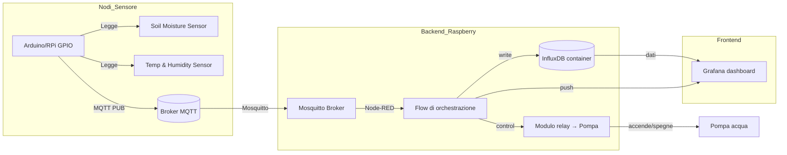

https://chatgpt.com/canvas/shared/68236a41ad588191b9e024e064e87920

```mermaid
flowchart LR
  subgraph Nodi_Sensore
    A[Arduino/RPi GPIO] -->|Legge| S1[Soil Moisture Sensor]
    A -->|Legge| S2[Temp & Humidity Sensor]
    A -->|MQTT PUB| MQTT[(Broker MQTT)]
  end

  subgraph Backend_Raspberry
    MQTT -->|Mosquitto| M1[Mosquitto Broker]
    M1 -->|Node-RED| NR[Flow di orchestrazione]
    NR -->|write| InfluxDB[(InfluxDB container)]
    NR -->|control| Relay[Modulo relay → Pompa]
  end

  subgraph Frontend
    InfluxDB -->|dati| Grafana[Grafana dashboard]
    NR -->|push| Grafana
  end

  Relay -->|accende/spegne| Pump[Pompa acqua]

```